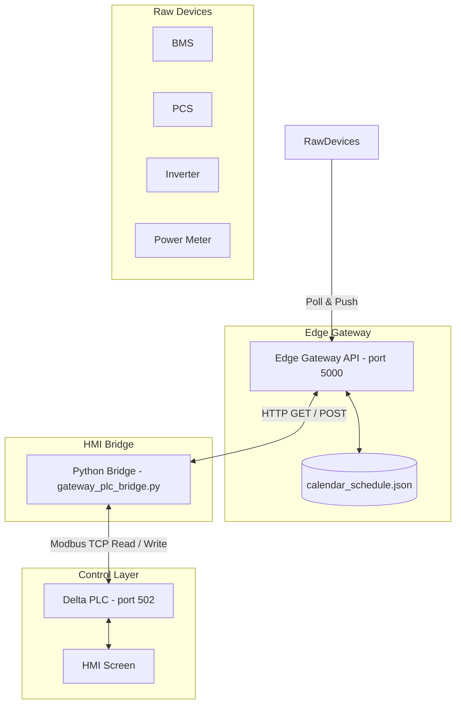

# HMI & PLC Data Bridge Architecture Guide

This document provides a complete technical specification and logic breakdown of the data bridge between the **PCS Edge Gateway Web API** and the **Delta DVP PLC / HMI**. It serves as a blueprint for developers or AI assistants (such as Antigravity) to understand, modify, or replicate this system in future projects.

---

## 1. System Architecture & Data Flow



### Roles:
1.  **Gateway API**: Periodically polls BMS, PCS, Inverter, and Power Meter, updates the internal state cache, and serves calendar schedules from `calendar_schedule.json`.
2.  **PLC**: The **Single Source of Truth** for HMI interactions. It handles button clicks, manages UI state (which day is selected, panel visibility), and runs local industrial safety/control logic.
3.  **Python Bridge (`gateway_plc_bridge.py`)**: A lightweight background service that bridges the API and the PLC. It performs:
    *   Reading telemetry from API and writing it to PLC.
    *   Syncing today's active schedule to PLC.
    *   Generating the 31-day calendar status arrays for Charge and Discharge.
    *   Observing which calendar day is selected in the PLC, fetching its schedule details, and writing them to the HMI detail registers.
4.  **HMI**: Displays the status arrays and details panel by reading PLC registers and coils.

---

## 2. Modbus Memory Map

Below is the exact register mapping between the Delta PLC and the Modbus TCP protocol used by `test.py`.

### A. System Configuration & Inputs
*   **PLC IP**: `192.168.0.5`
*   **Modbus Port**: `502`
*   **Base Offset**: Delta D-registers start at Modbus address `4096` (`1000H`). Delta M-coils start at `2048` (`0800H`).

### B. Shared Variables (Calendar Navigation)
| PLC Device | Modbus Address | Type | Description |
| :--- | :--- | :--- | :--- |
| **D260** | `4356` | Word | Viewed Month (0 = Jan, 11 = Dec) |
| **D261** | `4357` | Word | Viewed Year (e.g., 2026) |

### C. Charge Calendar Variables
| PLC Device | Modbus Address | Type | Description |
| :--- | :--- | :--- | :--- |
| **D262** | `4358` | Word | Day Click Trigger (writes day number 1-31 on press, resets to 0) |
| **D265** | `4361` | Word | Selected Day (currently active day number 1-31, 0 if closed) |
| **D270 - D300** | `4366 - 4396` | Word[31] | Status Array (`0` = Selected, `1` = Scheduled, `2` = Inactive/Standby) |
| **M300** | `2348` | Coil | Detail Panel Visibility (ON = visible, OFF = hidden) |
| **M301 - M331** | `2349 - 2379` | Coil[31] | Day Detail Buttons (ON = highlighted/active) |

### D. Discharge Calendar Variables
| PLC Device | Modbus Address | Type | Description |
| :--- | :--- | :--- | :--- |
| **D362** | `4458` | Word | Day Click Trigger (writes day number 1-31 on press, resets to 0) |
| **D365** | `4461` | Word | Selected Day (currently active day number 1-31, 0 if closed) |
| **D370 - D400** | `4466 - 4496` | Word[31] | Status Array (`0` = Selected, `1` = Scheduled, `2` = Inactive/Standby) |
| **M400** | `2448` | Coil | Detail Panel Visibility (ON = visible, OFF = hidden) |
| **M401 - M431** | `2449 - 2479` | Coil[31] | Day Detail Buttons (ON = highlighted/active) |

### E. Calendar Day Details (Shared Display registers)
When a day is selected (`D265 > 0` or `D365 > 0`), the Python script writes the schedules details to this block starting at **D310** (Modbus address `4406`):
*   **D310**: Charge Start Hour
*   **D311**: Charge Start Minute
*   **D312**: Charge End Hour
*   **D313**: Charge End Minute
*   **D314**: Charge Power Demand (kW)
*   *D315 - D319: Reserved (Padding)*
*   **D320**: Discharge Start Hour
*   **D321**: Discharge Start Minute
*   **D322**: Discharge End Hour
*   **D323**: Discharge End Minute
*   **D324**: Discharge Power Demand (kW)
*   **D325**: Holiday Indicator (0 = Normal, 1 = Holiday)

### F. Dynamic Calendar Day Existence (M29 - M31)
Used to hide nonexistent dates (like Day 31 in June, or Days 29-31 in February) on the HMI calendar grid:
*   **M29** (Modbus `2077`): ON if the month has $\ge 29$ days.
*   **M30** (Modbus `2078`): ON if the month has $\ge 30$ days.
*   **M31** (Modbus `2079`): ON if the month has $\ge 31$ days.

### G. Power Meter Telemetry (D4400 - D4414)
Polled from METER_API_URL and mapped to the PLC at Modbus base address `37168` (`32768 + 4400`):
*   **D4400** (`37168`): Grid Active Power (kW, signed, + = Import, - = Export)
*   **D4401** (`37169`): Grid Reactive Power (kVar, signed)
*   **D4402** (`37170`): Grid Apparent Power (kVA)
*   **D4403** (`37171`): Grid Power Factor (x1000, e.g. 980 = 0.98)
*   **D4404** (`37172`): Grid Frequency (x100 Hz, e.g. 5000 = 50.00 Hz)
*   **D4405** (`37173`): Grid Voltage R-S (÷10 V, e.g. 3980 = 398.0 V)
*   **D4406** (`37174`): Grid Voltage S-T (÷10 V)
*   **D4407** (`37175`): Grid Voltage T-R (÷10 V)
*   **D4408** (`37176`): Grid Current R (÷10 A)
*   **D4409** (`37177`): Grid Current S (÷10 A)
*   **D4410** (`37178`): Grid Current T (÷10 A)
*   **D4411 - D4412** (`37179 - 37180`): Total Import Energy (kWh, 32-bit integer, Low Word first)
*   **D4413 - D4414** (`37181 - 37182`): Total Export Energy (kWh, 32-bit integer, Low Word first)

### H. Solar Inverter Telemetry (D4500 - D4512)
Polled from INVERTER_API_URL and mapped to the PLC at Modbus base address `37268` (`32768 + 4500`):
*   **D4500** (`37268`): Inverter Active Power (kW, unsigned)
*   **D4501** (`37269`): Inverter Reactive Power (kVar, signed)
*   **D4502** (`37270`): Inverter Daily Generation (x10 kWh, e.g. 154 = 15.4 kWh)
*   **D4503 - D4504** (`37271 - 37272`): Inverter Total Generation (kWh, 32-bit integer, Low Word first)
*   **D4505** (`37273`): Inverter Voltage R (÷10 V)
*   **D4506** (`37274`): Inverter Voltage S (÷10 V)
*   **D4507** (`37275`): Inverter Voltage T (÷10 V)
*   **D4508** (`37276`): Inverter Current R (÷10 A)
*   **D4509** (`37277`): Inverter Current S (÷10 A)
*   **D4510** (`37278`): Inverter Current T (÷10 A)
*   **D4511** (`37279`): Cabinet Temperature (÷10 °C, e.g. 355 = 35.5 °C)
*   **D4512** (`37280`): Inverter Status Code (0=Off, 1=Standby, 2=Running, 3=Fault)

### I. BMS Telemetry (D4600 - D4608)
Polled from BMS_API_URL and mapped to the PLC at Modbus base address `37368` (`32768 + 4600`):
*   **D4600** (`37368`): BMS Total Voltage (÷10 V)
*   **D4601** (`37369`): BMS Total Current (÷10 A, signed, - = Discharge, + = Charge)
*   **D4602** (`37370`): BMS State of Charge (SOC, %)
*   **D4603** (`37371`): BMS State of Health (SOH, %)
*   **D4604** (`37372`): BMS Max Cell Voltage (mV, e.g. 3325 mV)
*   **D4605** (`37373`): BMS Min Cell Voltage (mV, e.g. 3280 mV)
*   **D4606** (`37374`): BMS Max Cell Temp (÷10 °C, e.g. 312 = 31.2 °C)
*   **D4607** (`37375`): BMS Min Cell Temp (÷10 °C)
*   **D4608** (`37376`): BMS Alarm Word (0 = No alarm, 1 = Alarm active)

---


## 3. PLC Ladder Logic (WPLSoft Instruction List)

Enter these instructions into WPLSoft (Instruction List mode) to configure the PLC side. Note: **Comparison instructions like `LD>` and `AND=` must not contain spaces around the operator.**

### A. Charge Page Logic (Controls D262, D265, M300-M331)
```text
(* 1. Calculate Index based on day clicked *)
LD> D262 K0
SUB D262 K1 E0
OUT M10

LD> D265 K0
SUB D265 K1 F0

(* 2. Determine state transition on rising edge *)
LD M10
AND= D270E0 K1
SET M11

LD M10
AND= D270E0 K0
SET M12

(* 3. Action: Toggle from Scheduled (1) to Selected (0) *)
LD M11
MOV K0 D270E0

LD M11
AND> D265 K0
MOV K1 D270F0

LD M11
MOV D262 D265

(* 4. Action: Toggle from Selected (0) back to Scheduled (1) *)
LD M12
MOV K1 D270E0
MOV K0 D265

(* 5. Clean up triggers *)
LD M10
RST M11
RST M12
MOV K0 D262

(* 6. Manage visibility coils M300-M331 *)
LD> D265 K0
OUT M300

LD> D265 K0
SUB D265 K1 D202
DECO D202 M301 K5

LD= D265 K0
ZRST M301 M331
```

### B. Discharge Page Logic (Controls D362, D365, M400-M431)
```text
(* 1. Calculate Index based on day clicked *)
LD> D362 K0
SUB D362 K1 E0
OUT M20

LD> D365 K0
SUB D365 K1 F0

(* 2. Determine state transition on rising edge *)
LD M20
AND= D370E0 K1
SET M21

LD M20
AND= D370E0 K0
SET M22

(* 3. Action: Toggle from Scheduled (1) to Selected (0) *)
LD M21
MOV K0 D370E0

LD M21
AND> D365 K0
MOV K1 D370F0

LD M21
MOV D362 D365

(* 4. Action: Toggle from Selected (0) back to Scheduled (1) *)
LD M22
MOV K1 D370E0
MOV K0 D365

(* 5. Clean up triggers *)
LD M20
RST M21
RST M22
MOV K0 D362

(* 6. Manage visibility coils M400-M431 *)
LD> D365 K0
OUT M400

LD> D365 K0
SUB D365 K1 D203
DECO D203 M401 K5

LD= D365 K0
ZRST M401 M431
```

---

## 4. Python Bridge (`gateway_plc_bridge.py`) Core Operations

The python script runs a loop with 1-second cycles. It avoids race conditions by treating the PLC as the master of the selected day.

1.  **Connection Watchdog**: Automatically reconnects if Modbus TCP disconnects.
2.  **Calendar Month Refresh**: Every 10 seconds (or when `D260/D261` changes):
    *   Determines viewed month days limit (`calendar.monthrange`) and writes visibility coils `M29-M31` to Modbus address `2077`.
    *   Fetches the calendar schedules from `SCHEDULE_API_URL/calendar`.
    *   Populates statuses lists (Charge and Discharge) and writes them to `D270` (`4366`) and `D370` (`4466`).
3.  **Active Day Selection Observer**:
    *   Reads `D265` and `D365` from PLC.
    *   If `D265 > 0` (Charge day selected) or `D365 > 0` (Discharge day selected):
        *   Loads the schedule data of that day.
        *   Extracts hours, minutes, and power demands.
        *   Writes them into `D310-D325` (`4406`).
    *   If both are `0` (closed), writes all `0`s to `D310-D325` to clear HMI numeric displays.

---

## 5. How to Adapt for a New Project (Customization Guide)

When deploying this bridge to a different project:

### 1. Change Target Addresses
If the PLC Modbus mapping changes, update these constants in `gateway_plc_bridge.py`:
*   `PLC_IP`: Modbus TCP server IP.
*   `client.read_holding_registers(4356, ...)`: Update base register addresses (e.g., if D260 shifts from `4356`).
*   `client.write_coils(2077, ...)`: Update the `M29-M31` coils address offset.

### 2. Add New Devices (e.g., Inverter & Power Meter)
To read new values from the Gateway API (like Solar Inverter Generation Power or Grid Meter Power) and write them to the PLC:
1.  Add the new REST API endpoint URL or parse it from `API_URL` response data.
2.  Add parsing logic in the telemetry fetch block in `gateway_plc_bridge.py`.
3.  Designate new PLC Registers (e.g., `D500` for Inverter kW, `D502` for Grid kW).
4.  Write the values using Modbus:
    ```python
    inv_kw = api_data.get("inverterPowerKw", 0)
    grid_kw = api_data.get("gridPowerKw", 0)
    client.write_registers(4596, [to_u16(inv_kw * 10), to_u16(grid_kw * 10)]) # D500 & D502
    ```
5.  In the HMI program, add numeric displays reading `D500` and `D502`.
